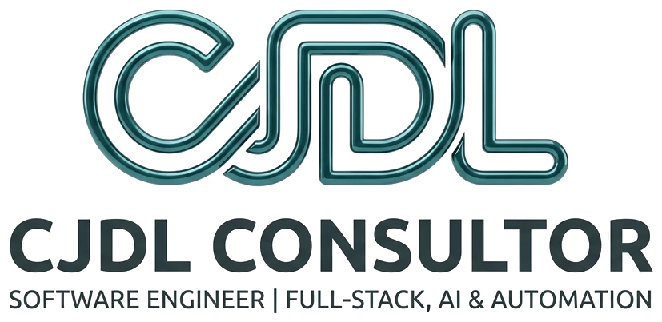

<picture>
  <source media="(prefers-color-scheme: dark)" srcset="assets/logo-dark.png" />
  <source media="(prefers-color-scheme: light)" srcset="assets/logo-light.png" />
  
</picture>

 

---

## Perfil

Ingeniero de software independiente. Diseño y desarrollo sistemas web de extremo a extremo para negocios: desde la arquitectura y la base de datos hasta la interfaz y el despliegue. Me enfoco en software mantenible, que resuelva un problema operativo real y que el cliente pueda hacer crecer.

## Servicios

| | |
| --- | --- |
| **Desarrollo Full-Stack** | Aplicaciones web y APIs con Next.js, React, Node.js y Laravel. |
| **Plataformas SaaS** | Productos multi-tenant con autenticación, pagos en línea y paneles de administración. |
| **IA y automatización** | Integración de modelos de lenguaje y automatización de procesos repetitivos. |
| **Arquitectura y bases de datos** | Modelado, optimización y migración sobre PostgreSQL y MariaDB. |

## Stack

## Proyectos

Productos desarrollados bajo **EINNOVACION MX**:

| Proyecto | Descripción |
| --- | --- |
| **Sync** | Plataforma SaaS B2B multi-tenant para agencias digitales: gestión de proyectos, cobro por hitos y bóveda cifrada de entregables. Next.js, Supabase, Mercado Pago y Stripe. |
| **PassCore** | Plataforma multi-tenant para eventos privados: invitaciones digitales, RSVP nominal, control de accesos y notificaciones automáticas. Next.js, Prisma y PostgreSQL. |
| **Photo Event** | Galería colaborativa para bodas y eventos: los invitados suben fotos desde el celular sin crear cuenta y la galería crece en vivo. Next.js, PostgreSQL y procesamiento de imágenes en segundo plano. |
| **Loyalty API** | API REST de programas de lealtad para comercios: tarjetas, puntos y recompensas. Node.js y SQL. |

## Actividad

  

<picture>
  <source media="(prefers-color-scheme: dark)" srcset="https://raw.githubusercontent.com/jossssdl/jossssdl/output/github-snake-dark.svg" />
  <source media="(prefers-color-scheme: light)" srcset="https://raw.githubusercontent.com/jossssdl/jossssdl/output/github-snake.svg" />
  
</picture>

## Contacto

¿Tienes un proyecto en mente? Escríbeme.

